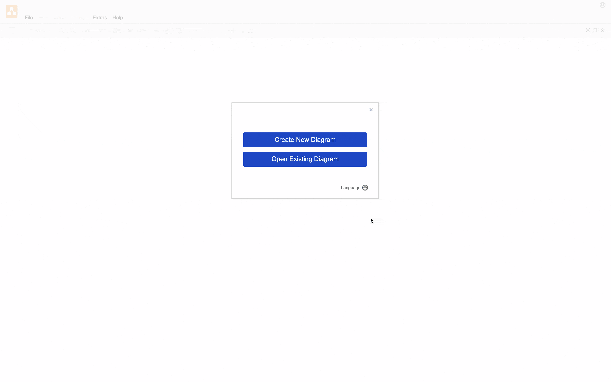
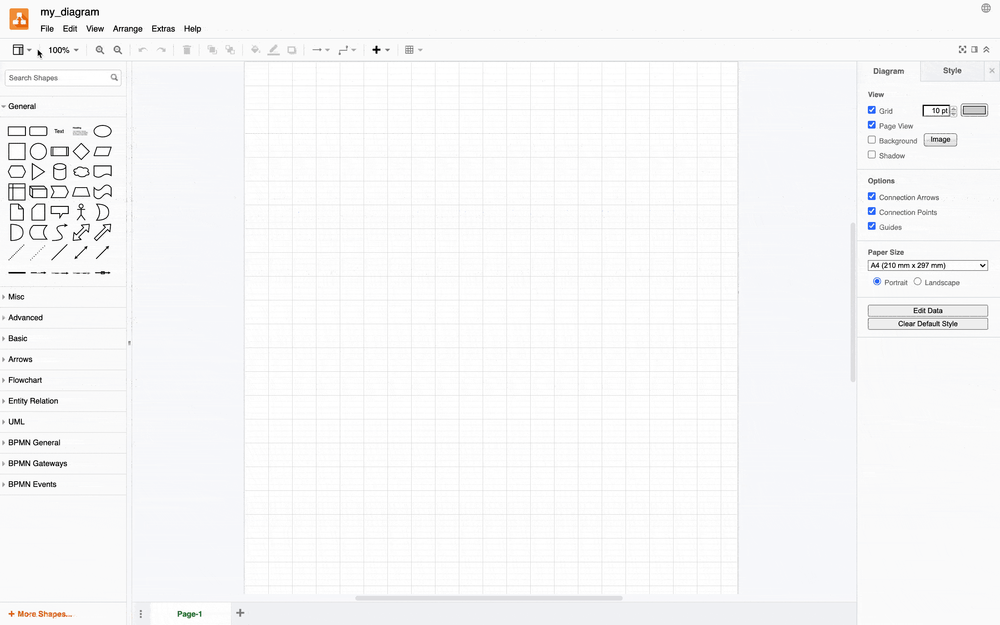
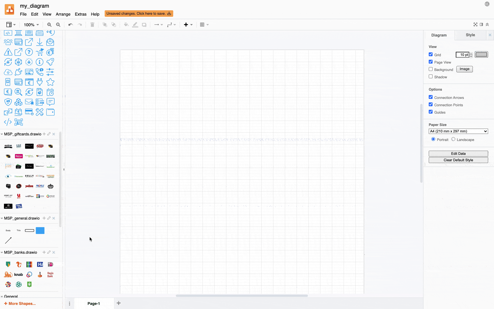

# Docs diagrams
The development of Docs' diagrams is done through draw.io (formerly diagrams.net), which is available as [Web App](https://app.diagrams.net/), [desktop application](https://github.com/jgraph/drawio-desktop/releases/tag/v13.9.9) and [VS Code extension](https://marketplace.visualstudio.com/items?itemName=hediet.vscode-drawio).

This repository contains:
- up-to-date MultiSafepay draw.io libraries
- source files for all published diagrams

## Requirements
- Draw.io client of choice

## Installing 

Clone or download this repository to your local system. All libraries are contained within the `libraries` directory.

## Usage

### 1. Create a new diagram
Open the draw.io application of choice, click `Create New Diagram`, type the diagram name and click `Create`.

### 2. Importing libraries
To start using the MultiSafepay diagram libraries, manually import them one by one. To do this, Click `File` > `Open Library...` > Select the path of the library.

Repeat this step for every library untill all libraries are imported. 

### 3. Drag and drop elements!
It's as easy as that

The [desktop application](https://github.com/jgraph/drawio-desktop/releases/tag/v13.9.9) saves the state of the workplace so that upon re-opening the application, libraries are automatically imported.

Questions and feedback are welcome through [Issues section](https://github.com/MultiSafepay/docs/issues) or <kris.stallenberg@multisafepay.com>
